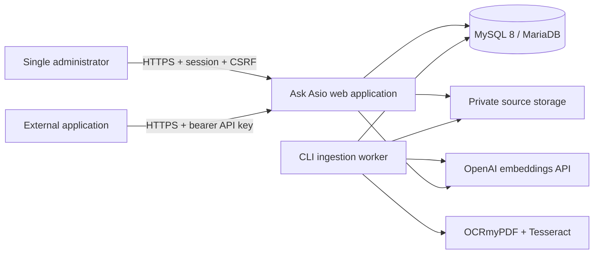
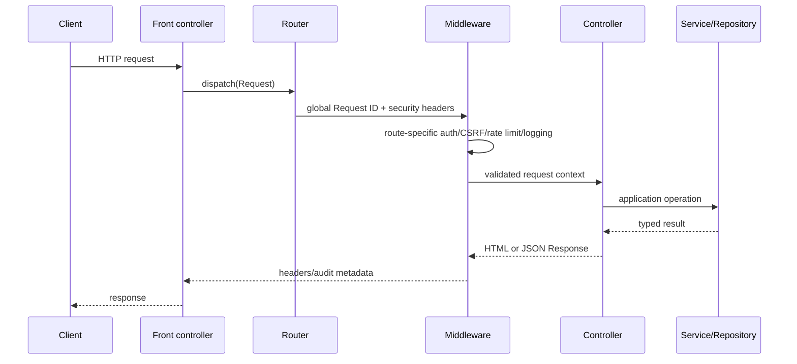
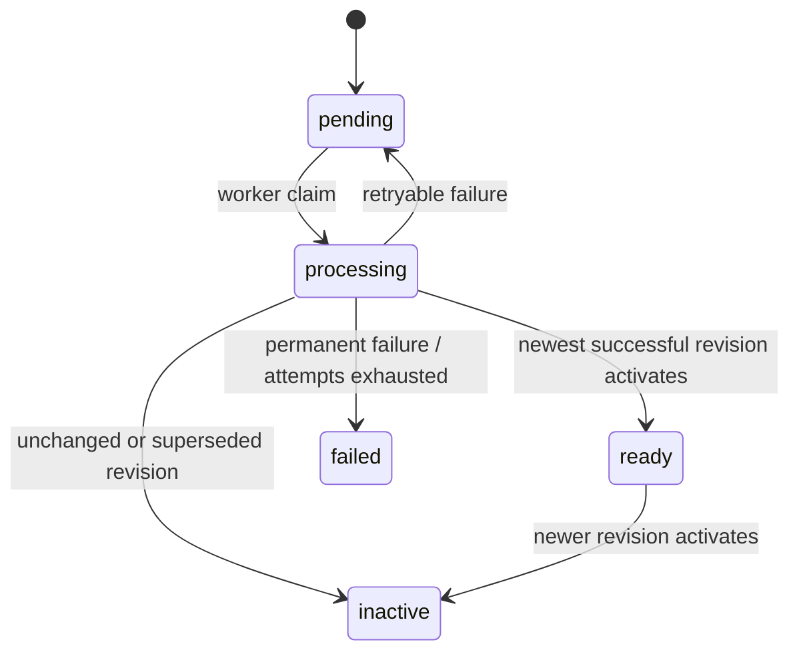
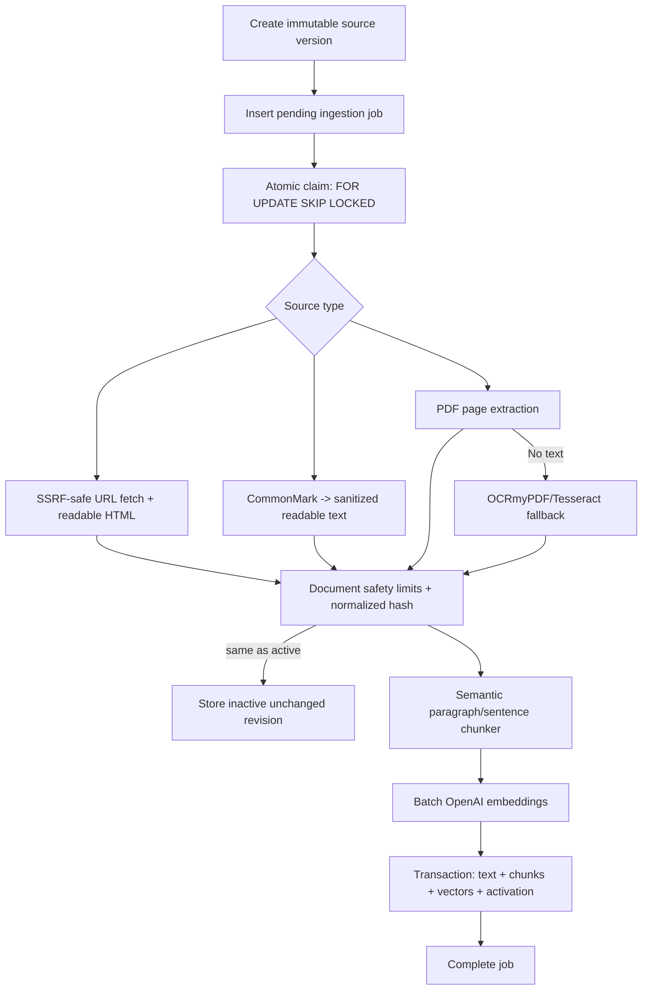
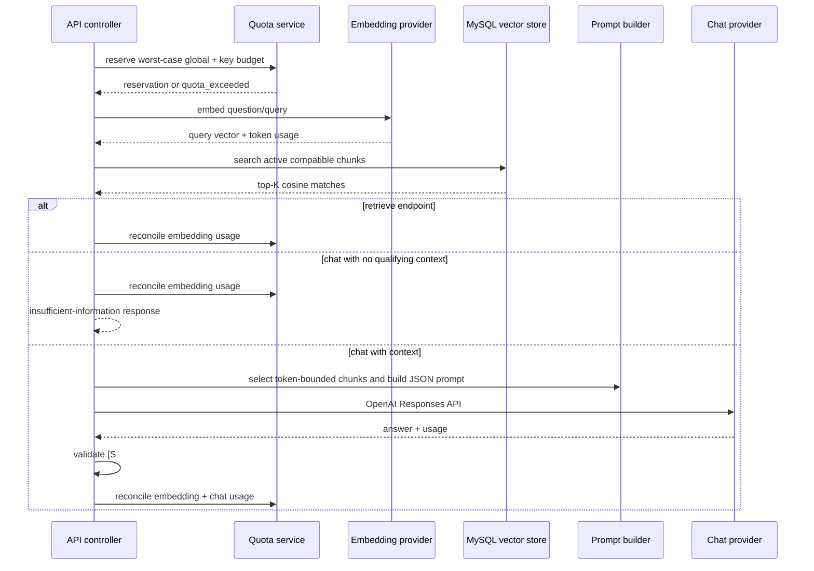

# Architecture

## Purpose and scope

Ask Asio is a standalone, single-administrator Retrieval-Augmented Generation application. Administrators manage URL, Markdown, and PDF knowledge sources through a server-rendered dashboard. External applications use bearer-authenticated REST endpoints to retrieve relevant chunks or request a grounded answer with citations.

The application deliberately uses PHP 8.3+, PDO, MySQL 8, Composer packages, server-rendered PHP templates, and vanilla JavaScript without an application framework. It is single-tenant today, but integration boundaries and repository/service layers make later provider or vector-store replacement possible.

The customer-facing chatbot now has administration, publication/draft-preview persistence, a shared grounding boundary, authenticated preview, and exact-origin public configuration/session creation with hash-only tokens and IP/chatbot limits. Public messaging and widget behavior remain unavailable. See [Public configuration and session API](customer-facing-chatbot/public-configuration-and-session-api.md), [Administrator preview](customer-facing-chatbot/admin-preview.md), and [Shared chat execution](customer-facing-chatbot/shared-chat-execution.md).

## System context



Only `public/` is web-accessible. Application code, `.env`, uploads, logs, cache, and CLI scripts are outside the web root.

## Runtime components

| Component | Responsibility |
| --- | --- |
| `public/index.php` | Front controller; creates request, boots the application, dispatches the router, and delegates failures to the safe error handler. |
| `bootstrap/app.php` | Web composition root. Loads environment/configuration and constructs controllers, middleware, repositories, and RAG services. |
| `app/Http/` | Framework-free request, response, router, route, JSON parsing, and error handling. |
| `app/Http/Middleware/` | Request IDs, security headers, sessions, admin authentication, CSRF, API authentication, rate limiting, and request audit logging. |
| `app/Controllers/Admin/` | Thin server-rendered dashboard actions. |
| `app/Controllers/Api/` | Health, retrieval, and grounded chat JSON endpoints. |
| `app/Services/` | Application workflows for sources, jobs, API keys, activity retention/purge, list queries, provider quotas, and chatbot lifecycle/configuration/conversation persistence. |
| `app/Repositories/` | PDO persistence plus interfaces and allowlisted SQL query builders. Controllers do not contain raw SQL. |
| `app/Ingestion/` | Extractor registry, URL/Markdown/PDF extraction, OCR, safety limits, semantic chunking, processing, and worker behavior. |
| `app/Providers/` | OpenAI HTTP client and provider-independent embedding/chat interfaces. |
| `app/RAG/` | Retrieval, cosine similarity, context selection, grounded prompting, answer validation, and embedding backfill. |
| `resources/views/` | Escaped PHP templates with no persistence or domain workflows. |
| `bin/` | Migrations, admin creation, workers, recovery, retention, embedding backfill, and retrieval diagnostics. |
| `database/migrations/` | Ordered, forward-only schema history, including additive chatbot publication and conversation tables. |

## Directory structure

```text
app/
  Auth/                 administrator authentication and sessions
  Controllers/          admin HTML and API JSON entry points
  Database/             lazy PDO connection and migrations
  Domain/               typed records, enums, and value objects
  Http/                  request/response/router/middleware
  Ingestion/             extraction, OCR, chunking, worker safety
  Logging/               rotating logger and secret redaction
  Maintenance/           advisory-lock abstractions
  Networking/            SSRF-safe URL validation/fetching
  Providers/             OpenAI client, embedding, and chat adapters
  RAG/                   retrieval and grounded answer generation
  Repositories/          interfaces, PDO adapters, SQL builders
  Security/              CSRF and upload/URL validation
  Services/              application use cases
  Support/               configuration, views, pagination, query strings
bin/                     CLI entry points
bootstrap/               composition roots for web/worker/maintenance/RAG
config/                  immutable environment-backed configuration
database/migrations/     ordered schema changes
deploy/systemd/          hardened worker unit
public/                  sole document root and static assets
resources/views/         server-rendered templates
storage/                 private files, logs, and disposable caches
tests/                   unit fakes plus opt-in real-DB integration tests
```

## Web request lifecycle



Global middleware assigns a UUIDv7 request ID and security headers. Admin routes then start the session, require the single administrator, and validate CSRF on state-changing requests. Paid API routes are wrapped by audit logging, bearer authentication, and endpoint-specific fixed-window rate limiting before their controller executes.

Expected failures become `HttpException` responses. Unexpected failures are logged with the request ID and returned as generic HTML or JSON without stack traces or secrets.

## Administrator authentication flow

1. `php bin/create-admin.php` creates the only administrator after interactive validation.
2. Passwords use `password_hash()` with Argon2id when available and `password_verify()` at login.
3. Login attempts are recorded using HMAC-hashed normalized username and client IP; configured limits apply over a fixed window.
4. On successful login, the session ID regenerates and the administrator ID is stored in a strict, cookie-only PHP session.
5. Session cookies are `HttpOnly`, `SameSite=Lax`, and `Secure` when configured or directly accessed through HTTPS.
6. A session-bound 256-bit CSRF token protects all state-changing admin routes, including logout.
7. Idle expiry and periodic session ID regeneration are enforced by `NativeSessionStore`.

The application does not trust forwarded proxy headers. See the trusted-proxy work in [Roadmap](roadmap.md).

## Knowledge-source lifecycle

`sources` stores mutable identity and availability; `source_versions` stores immutable revisions. A create, replacement upload, URL refresh, or reprocess operation creates a new version and an ingestion job in one transaction. The previous active revision remains retrievable until the new revision is fully processed.



Activation is transactional and ordered: an older concurrent job cannot replace a newer revision. Failed work never displaces the active version. Disabling or soft-deleting a source removes it from retrieval without erasing history. Permanent deletion requires soft deletion, exact-name confirmation, no live jobs, and removes records plus private files.

## Ingestion pipeline



The worker validates the combined timeout/reservation policy at startup. Controlled ingestion failures follow exponential retry or permanent-failure rules. Infrastructure or unexpected failures are logged at critical level and terminate the process deliberately; systemd starts a clean process. Abandoned jobs are recovered automatically before claims and by `bin/recover-jobs.php`.

Hard limits exist for extracted characters, PDF pages, chunk count, upload/response bytes, OCR output, timeouts, and embedding batch size. Exceeding a document boundary is a permanent failure before embedding and preserves the previous active revision.

## RAG query and answer flow



The retriever embeds the complete query once; it does not split user questions into chunks. `PdoVectorStore` loads vectors for enabled, non-deleted sources whose active revision is ready and whose embedding model/dimensions match the configured provider. Cosine similarity is computed in PHP, filtered by threshold, sorted deterministically, and truncated to `top_k`.

For chat, `ContextSelector` admits the highest-ranked chunks that fit the configured estimated-token budget. `PromptBuilder` keeps instructions separate and encodes the question and source excerpts as untrusted JSON. The model must use only supplied context and cite `[S1]`, `[S2]`, etc.; `AnswerGenerator` rejects missing or out-of-range citations. No chat-generation call is made when retrieval yields no qualifying context.

## Provider quota architecture

Authenticated retrieve/chat requests atomically reserve four UTC buckets: global daily, global monthly, API-key daily, and API-key monthly. `SELECT ... FOR UPDATE` prevents concurrent requests from spending the same remaining allowance. The reservation is deliberately conservative. Success replaces it with exact provider usage where available; ambiguous post-call failure or expired reservations charge the full estimate. Finalization updates compact period buckets and deletes the transient reservation in one transaction.

Quotas cover customer-facing retrieve/chat calls only. Administrator-triggered ingestion embeddings remain bounded by document limits and the provider account's own project budget.

## Data, storage, and caching

- MySQL stores relational state, extracted text, chunks, JSON embeddings, audit metadata, fixed-window rate buckets, and quota buckets.
- Uploaded originals live under `FILESYSTEM_PATH`, outside `public/`, with randomized server names.
- Application logs live under `storage/logs/` and rotate daily with 14 retained files by default.
- PHP sessions use the configured native PHP session backend.
- There is no Redis dependency and no application response, retrieval, or query-embedding cache.
- `storage/cache/` is currently tooling/disposable cache space, notably for PHPStan.

The lack of a query-embedding cache is intentional simplicity but increases repeated provider cost. The lack of an ANN/vector database is the primary corpus-scaling limit.

## Configuration

`vlucas/phpdotenv` loads `.env`; `Config::load()` then loads every `config/*.php` file into immutable sections. Typed `Env`/`Config` access rejects malformed values. Secrets live only in `.env` or the process environment and must never be rendered or logged. See [Deployment](deployment.md#environment-variables).

## Deployment architecture

The production baseline is Apache + PHP-FPM for web requests, MySQL 8 on a private interface, a persistent systemd ingestion worker, private filesystem storage, OCRmyPDF/Tesseract, and outbound HTTPS to OpenAI and administrator-approved public URLs. Daily cron performs API Activity retention; periodic cron recovers abandoned jobs. Redis is neither required nor used.

## External services and packages

- OpenAI embeddings and Responses APIs are the only implemented AI provider integrations.
- OCRmyPDF/Tesseract is an optional host-level executable, required when OCR fallback is enabled; it is not a Composer/PHP package.
- Composer packages: `phpdotenv`, Monolog, Ramsey UUID, CommonMark, Smalot PDF parser, and Guzzle PSR-7 utilities.
- Anthropic variables remain in `.env.example`, but no Anthropic provider exists yet.

## Future architectural considerations

1. Introduce trusted-proxy configuration before deploying behind a TLS-terminating proxy.
2. Replace full-corpus PHP cosine search before the corpus materially exceeds roughly 10,000 active chunks or measurements show unacceptable latency/memory.
3. Add ingestion-job retention, query-embedding caching, and provider cost mapping.
4. Replace heuristic token estimation with a model-aware tokenizer and add an evaluation harness before threshold/chunker changes.
5. Multi-tenancy requires schema-level ownership (`tenant_id`/`account_id`) on every resource and cannot be added only at the controller layer.
6. If asynchronous workloads expand beyond ingestion, generalize the MySQL queue carefully rather than introducing Redis prematurely.
