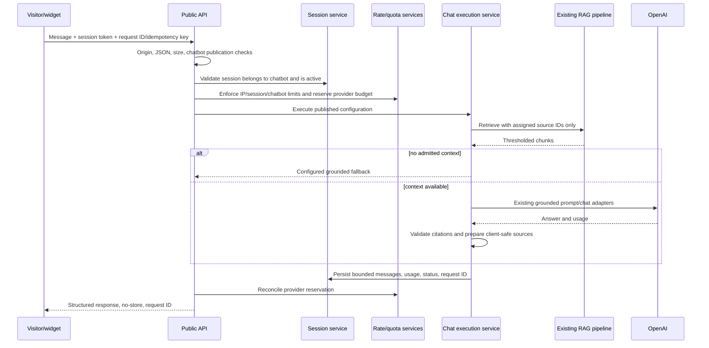

# Architecture and data

## Existing foundations to reuse

The feature extends these implemented boundaries:

- custom router and middleware with UUIDv7 request IDs, safe errors, JSON parsing, body limits, auth, rate limiting, quota reservation, and API Activity logging;
- server-rendered admin controllers/views protected by session authentication and CSRF;
- service/repository/PDO separation with explicit composition in `bootstrap/app.php`;
- immutable source revisions and retrieval eligibility rules;
- `Retriever`, `ContextSelector`, `PromptBuilder`, `AnswerGenerator`, embedding/chat provider interfaces, and citation validation;
- hash-only `rag_live_` API keys, fixed-window database counters, and global/per-key provider-token quotas;
- migration, pagination, advisory-lock purge, logging/redaction, and test conventions.

The feature must not create a parallel retriever, prompt builder, provider client, rate limiter, error envelope, logger, queue, or admin component system.

## Target component boundaries

| Component | Responsibility |
| --- | --- |
| Chatbot admin controller | Bind HTTP input, call services, render/redirect. |
| Chatbot configuration service | Validate drafts, assignments, publication, public-ID rotation, and lifecycle transitions. |
| Chatbot repository | Bounded projections and transactional persistence. |
| Conversation service/repositories | Create/validate sessions, persist messages/usage, enforce expiry/count/retention. |
| Chat execution service | Shared preview/public orchestration: validate config, retrieve assigned sources, ground/generate/fallback, persist outcome, reconcile quota. |
| Public chatbot controllers | Client-safe configuration, session creation, message submission, restart/completion, and authenticated hard deletion. |
| Origin middleware/policy | Normalize and match exact configured origins; add CORS response behavior. |
| Integration credential middleware | Authenticate hash-only secrets and enforce chatbot scopes for server calls. |
| Widget assets | Versioned isolated client consuming only public schemas. |

## Public message flow

Quota handling must preserve the current conservative rule: ambiguous post-provider failure is charged at the reserved estimate. Persistence failures after a provider response need an explicit failure state and must not trigger a blind provider retry.

## Source scoping invariant

The execution service obtains assigned source IDs from the server-side published configuration. It never accepts `source_ids` from a public client. Those IDs are passed to the existing retriever/vector store, which still enforces enabled, non-deleted, active-ready, embedding-model-compatible chunks.

The invariant must be tested at repository, service, and HTTP levels: a session for chatbot A cannot cause retrieval from sources assigned only to chatbot B.

## Proposed lifecycle

### Chatbot

- unpublished: `active_publication_id` is null; preview of the mutable draft is allowed to the administrator.
- active: may be used publicly when an active publication exists and provider/model health matches its snapshot.
- disabled: public config/session/message calls fail safely; admin preview remains possible.
- archived: excluded from normal lists and public use; retained conversations follow their copied retention policy.
- permanently deleted: confirmed hard deletion of the chatbot and remaining dependent live records; backups remain separate.

### Session

- `active`: may accept messages until idle/absolute expiry and message limit.
- `completed`: visitor restart/close or server completion; no more messages.
- `expired`: server detects expiry; no more messages.
- `blocked`: abuse/policy decision; no more messages.
- purged: represented by hard deletion rather than a durable conversation tombstone; content-free Activity may remain independently.

### Message

- `pending`: accepted and reserved but no final outcome yet.
- `completed`: persisted response/fallback with usage.
- `failed`: safe failure category recorded; partial assistant text is not treated as complete.
- `cancelled`: reserved for explicitly supported cancellation/stream interruption.

## Proposed schema

This schema is intentionally single-tenant. It contains no `tenant_id`, `account_id`, `workspace_id`, `created_by`, or `updated_by` because there is one administrator and no ownership boundary those columns could enforce.

### `chatbots`

| Column | Purpose |
| --- | --- |
| `id` | Internal bigint primary key. |
| `public_id` | Unique high-entropy opaque identifier, rotatable. |
| `name`, `description` | Internal administration fields. |
| `status` | Immediate availability: `active`, `disabled`, or `archived`. |
| `active_publication_id` | Nullable pointer to the only production configuration. |
| `created_at`, `updated_at`, `deleted_at` | UTC lifecycle timestamps. |

Draft/published state is derived from the active pointer rather than mixed into `status`.

### `chatbot_drafts` and draft relations

The one-to-one draft stores a schema version, optimistic revision, normalized runtime/security/privacy fields, validated presentation/appearance JSON, and update timestamp. Mutable `chatbot_draft_sources` and `chatbot_draft_origins` relations have unique `(chatbot_id, source_id)` and `(chatbot_id, normalized_origin)` constraints.

Frequently filtered, constrained, or security-critical settings are normalized. Only bounded presentation/appearance values use schema-versioned JSON. No source content or embeddings are duplicated.

### `chatbot_publications` and publication relations

Every publication is an immutable numbered snapshot containing the source draft revision, configuration schema/hash, all normalized settings, bounded presentation/appearance JSON, effective installation provider/chat/embedding model metadata, and publication time. `chatbot_publication_sources` and `chatbot_publication_origins` freeze the authorized relations for that version.

Publishing inserts the snapshot and child rows and updates `chatbots.active_publication_id` in one transaction. Public execution reads these tables only, never mutable drafts. Published rows are append-only.

### `chatbot_sessions`

- internal ID, unique high-entropy public session ID, token hash, and safe token prefix;
- `chatbot_id` and immutable `chatbot_publication_id`;
- origin, bounded visitor/external reference, validated metadata JSON;
- `is_test`, status, message count, input/output/provider token totals;
- copied retention policy and configuration version;
- started, last activity, absolute/idle expiry, completed, and deletion timestamps;
- indexes for chatbot/date/status/test pagination and retention batches.

Session creation returns a separate 256-bit bearer token once, stores only SHA-256 hash plus safe prefix, and authenticates it through the `Authorization` header. Browser state uses per-tab `sessionStorage`; tokens are unrecoverable and never appear in URLs/cookies/logs.

### `chatbot_messages`

- internal ID and `session_id`;
- role, content, status;
- provider/model, latency, input/output/embedding/provider totals;
- bounded retrieval/citation JSON, safe error code, request ID;
- optional unique idempotency key scoped to session;
- `created_at` plus indexes for chronological session reads and retention.

Message content is persisted while the session is active. Retention choices are `0`, `7`, `30`, or `90` days, default `30`, measured from last activity and copied into the session. Zero-day sessions become purge-eligible on completion/expiry. Do not duplicate content in Activity or logs.

### `chatbot_integration_credentials` (deferred milestone)

- internal ID, name, safe prefix, unique secret hash;
- status, last-used, expiry, created/revoked timestamps.

`chatbot_integration_credential_scopes(credential_id, chatbot_id)` provides enforceable referential scope. These credentials are a distinct resource from both the environment provider key and existing general `rag_live_` API keys; they reuse hash-only patterns but cannot authenticate general retrieve/chat or admin routes.

## Transaction boundaries

- Create/update draft plus source/origin assignments and optimistic revision must either fully commit or leave the prior draft unchanged.
- Inserting an immutable publication, its source/origin rows, and activating its pointer must be atomic.
- Session message-count reservation/idempotency and user-message acceptance must prevent concurrent limit bypass.
- Assistant outcome, usage, citations, and session totals should commit together.
- Retention/manual purge uses advisory locks and bounded transactions.
- Public-ID rotation must atomically invalidate the prior mapping.
- Public/administrator purge hard-deletes sessions and cascades messages; restart only completes a session.

## Migration policy

Use ordered forward migrations and never edit an applied migration. Test clean migration and a second idempotent pass against disposable MySQL. Because MySQL DDL may auto-commit, every milestone with schema changes needs backup, deployment order, and forward-repair notes; reversible `down()` methods are not a substitute for that plan.
