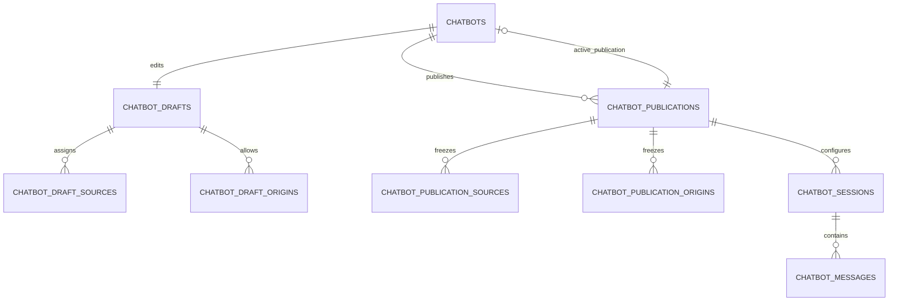

# Vertical-slice design

## Purpose

This design connects the accepted chatbot ADRs into one end-to-end implementation shape before migrations begin. The first usable vertical slice is deliberately narrow: the administrator creates a draft, assigns sources/origins, publishes it, creates an admin test session through the shared execution service, and can inspect the resulting retained conversation. Public routes and the widget build on the same publication/session/execution boundaries in later milestones.

The slice does not add multi-tenancy, provider credential storage, per-chatbot model selection, streaming, a WordPress plugin, or general-knowledge answers.

## Configuration aggregate

### `chatbots`: identity and immediate controls

The identity row owns the internal ID, rotatable public ID, internal name/description, lifecycle (`active`, `disabled`, `archived`), nullable `active_publication_id`, and UTC audit/deletion timestamps. A chatbot with no active publication is a draft even when its identity row is active. Disabling blocks public configuration, session creation, and messages immediately without altering the publication or draft.

`active_publication_id` is the only production pointer. Public execution must not join to mutable draft tables.

### Mutable draft

`chatbot_drafts` is a one-to-one mutable record. It contains a schema version, monotonic draft revision, normalized runtime/privacy fields, validated presentation/appearance JSON, and update timestamp. `chatbot_draft_sources` and `chatbot_draft_origins` are mutable child relations.

Saving the draft and replacing its source/origin relations is one transaction. Optimistic revision checking should reject a stale form rather than overwrite a newer draft.

### Immutable publication

`chatbot_publications` contains the chatbot ID, monotonically increasing publication number, source draft revision, configuration schema version and hash, every normalized setting, bounded presentation/appearance JSON, effective provider/chat/embedding model metadata, and publication timestamp. Child publication-source and publication-origin rows freeze the authorized relations.

Publishing is one transaction:

1. Lock the chatbot and current draft.
2. Validate provider/model health, normalized settings, JSON schema, source readiness/embedding compatibility, and origins.
3. Insert the next publication and its source/origin rows.
4. Point `chatbots.active_publication_id` to the inserted publication.
5. Commit; only then is the version publicly observable.

No publication row or child relation is updated. Republishing unchanged content is rejected or treated as an explicit no-op rather than creating unbounded identical versions. Re-activating a historical version must revalidate it against current source/provider state and record an auditable activation action; it never edits that version.

## Initial settings contract

### Normalized fields

| Setting | Initial policy |
| --- | --- |
| `system_instructions` | Server-only, bounded plain text. |
| `fallback_message` | Bounded plain text; grounded no-evidence behavior remains mandatory. |
| `retrieval_top_k` | Integer within existing chat maximum; default current `RAG_CHAT_TOP_K`. |
| `minimum_similarity` | Float in an approved safe range; default current retrieval threshold. |
| `citations_enabled` | Boolean controlling public display, not internal citation validation. |
| `maximum_message_characters` | Positive integer no higher than application/provider bounds. |
| `maximum_messages_per_session` | Positive bounded integer. |
| `idle_expiry_minutes` | Positive bounded duration. |
| `absolute_expiry_minutes` | Greater than idle expiry and independently bounded. |
| `retention_days` | Enum `0`, `7`, `30`, `90`; default `30`. |
| `privacy_notice_url` | Nullable validated HTTPS URL. |
| `disclosure_text` | Bounded public plain text identifying automated assistance. |
| effective provider/model fields | Copied from validated installation configuration at publish time; not admin-editable. |

The exact numeric defaults/bounds become authoritative in typed config and validation when implementation begins. They must not be duplicated inconsistently between controllers, services, and database checks.

### Schema-versioned JSON

`presentation_json` initially allows only display name, welcome message, input placeholder, and a bounded ordered list of starter questions. `appearance_json` initially allows only the `floating|inline_fullscreen` layout, accent color, `light|dark` theme, `left|right` floating position, approved launcher icon/label, panel title, and `compact|standard` floating size.

Unknown keys, arbitrary HTML/CSS/JavaScript, invalid enums/colors, excess array items, and overlong strings are rejected. Public configuration is produced by an explicit DTO allowlist, never by returning these JSON documents directly.

### Relations

Source assignment and allowed origins remain normalized child relations. Exact normalized origins are unique within one draft/publication. Source relations reference existing `sources` and never copy documents or embeddings.

## Model configuration behavior

The administrator sees read-only provider, chat model, embedding model/dimensions, and health. No model selector appears in v1.

Publication copies the effective values. At public execution, these values must equal the installation configuration. A mismatch marks the publication configuration-stale: new public sessions/messages fail with a safe availability/configuration error, the admin UI explains that review and republish are required, and preview runs only after explicitly choosing the current draft/configuration. Existing conversation records retain the model actually used per completed message.

This check prevents an environment change from silently altering published chatbot behavior. Source retrieval independently continues to require chunk embedding model/dimension compatibility.

## Session and message boundary

Session creation generates:

- a public non-secret session ID for routing/correlation;
- a separate token with 256 random bits and a recognizable non-secret type/version prefix;
- a stored SHA-256 token hash and safe prefix only;
- chatbot ID, publication ID, normalized origin/integration context, test flag, status, idle/absolute expiry, counters, retention policy copied from the publication, and timestamps.

The plaintext token is returned once. Browser requests send it in `Authorization: Bearer`; admin preview authenticates through the admin session but still creates a test session bound to a publication/draft execution descriptor. Public session tokens never authorize admin diagnostics.

Messages store bounded content, status, role, actual provider/model, usage, latency, citation/retrieval metadata, safe error, request ID, idempotency key/hash, and timestamp. Message acceptance and session count/idempotency reservation are atomic. A completed answer/fallback and session aggregates commit together; ambiguous provider failure is not retried blindly.

## Browser state

The widget stores `{session_id, session_token}` only in `sessionStorage` under a key namespaced by API origin and chatbot public ID. Same-tab reload resumes. New tabs do not share the session. Tab closure or storage clearing loses the token and starts a new session; the old server session expires and follows retention. No transcript or internal configuration is written to browser storage.

The bearer header requires an allowed CORS preflight. Neither the session ID nor token appears in query parameters, fragment identifiers, cookies, embed attributes, or logs.

## Conversation privacy and deletion

- Active sessions persist message content because the execution service needs prior turns.
- Retention is copied from the publication into the session so later configuration edits do not change the session's promise silently.
- `retention_days=0` makes a completed/expired session immediately purge-eligible; 7/30/90 use last activity plus the selected interval.
- Visitor restart marks the current session completed and creates a new session. It does not erase the old session.
- Authenticated public deletion hard-deletes the live session and cascades messages. Unknown/already-deleted credentials receive the same empty `204` response.
- Administrator purge hard-deletes the reviewed scope through the established intent/advisory-lock/bounded-delete pattern.
- Archiving a chatbot blocks public use and leaves conversations to their copied retention schedule. Confirmed permanent deletion removes remaining dependent live records.
- Content-free API Activity and logs follow their independent retention; backups follow the operator's separate policy.

## Integration credential boundary

Server integrations use a later, separate credential aggregate. Its authentication middleware resolves a hash-only credential, checks status/expiry, then checks an explicit credential-to-chatbot scope before session creation or messaging. It cannot authenticate `/api/v1/retrieve`, `/api/v1/chat`, or admin routes. Existing `rag_live_` API keys retain their current contract unchanged.

Browser sessions and integration credentials are different layers: a trusted integration credential authorizes creating/acting for scoped chatbot sessions, while each resulting session still has server-owned chatbot/publication identity and conversation limits. Provider quotas always retain an installation-wide gate; per-integration accounting is added without weakening that gate.

## First persistence seams (completed)

Milestone 2 implements the configuration aggregate and persistence contracts needed for draft identity plus the core append-only publication table:

- chatbot identity and mutable draft;
- validated normalized/JSON settings value objects;
- public ID generation/rotation;
- repository projections and optimistic draft revision;
- core publication activation exists only behind an unwired service.

Milestone 3 adds mutable and immutable source/origin relations to the publication transaction, assignment-inclusive hashes, active-version source readiness, and deletion dependency protection. Runtime configuration-staleness validation remains part of the later public execution boundary. No session, public API, or widget exists yet.

## Acceptance checks before migration work

- ADRs 027–031 and this design are approved.
- Table/field names may be refined during migration design without changing these boundaries.
- Exact numeric configuration defaults/bounds are proposed and reviewed in the implementation milestone.
- Every public read is demonstrably rooted at `active_publication_id`, never mutable draft state.
- No table introduces tenant/account/workspace ownership or database-stored provider secrets.
