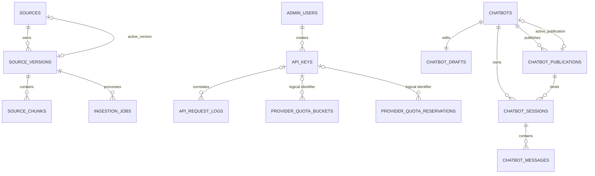

# Database

## Baseline

The application uses PDO with native MySQL prepared statements, exceptions, UTF-8 (`utf8mb4`), and a UTC connection timezone. MySQL 8.4 is exercised in CI. MariaDB is an intended target but is not currently exercised by CI; verify `SKIP LOCKED`, checks, JSON behavior, advisory locks, and upsert semantics against the selected MariaDB release before production use.

## Relationship overview

The API Activity and provider-quota relationships to API keys are deliberately logical rather than foreign-key constrained where historical numeric correlation must survive key deletion.

## Tables

### `schema_migrations`

Migration ledger with migration name, batch, and UTC application timestamp. Created by `Migrator`; not represented by a standalone migration.

### `settings`

Generic key/value/type table reserved for future application settings. It currently has no repository or UI and should not be treated as an active configuration source.

### `admin_users`

The single administrator: normalized unique username, password hash, last-login timestamp, and audit timestamps. Application logic and the CLI enforce one record.

### `admin_login_attempts`

HMAC-hashed username/IP identifiers plus attempt time. Composite time indexes support login throttling and cleanup/query windows. No raw username attempt or IP is stored.

### `sources`

Mutable knowledge-source identity:

- name and type (`url`, `markdown`, `pdf`);
- availability (`enabled`, `disabled`);
- nullable `active_version_id`;
- UTC timestamps and `deleted_at` soft deletion.

Indexes support availability/type filtering and deterministic updated/name ordering.

### `source_versions`

Immutable source revision:

- parent source and unique version number;
- original filename or URL and randomized private path;
- raw file hash and normalized extracted-content hash;
- MIME type and size;
- processing status (`pending`, `processing`, `ready`, `failed`, `inactive`);
- safe processing error, extracted text, and metadata JSON;
- processing and activation timestamps.

`sources.active_version_id` references this table; `source_versions.source_id` cascades on source deletion. Large `extracted_text` and metadata are excluded from list/history projections and loaded only on revision details.

### `source_chunks`

Ordered revision chunks with content, estimated token count, metadata JSON, embedding JSON, embedding model, dimensions, and embedding timestamp. `(source_version_id, chunk_number)` is unique. All chunks cascade with a deleted version.

Embeddings as JSON are acceptable for the first release but require PHP decoding and scoring; see scaling below.

### `ingestion_jobs`

Durable MySQL queue record containing source version, status, priority, attempts, availability, reservation owner/time, safe last error, and completion/failure timestamps. The claim index supports `pending + available_at + priority`; reservation and source-version history indexes support recovery and UI views.

Jobs cascade with source versions. Terminal jobs otherwise have no global retention policy and can grow indefinitely.

### `api_keys`

Application connection metadata: creator, name, safe prefix, SHA-256 secret hash, status, creation/last-use/expiry/revocation timestamps. Only the complete generated key is shown once. The unique hash supports authentication; status/expiry and list-order indexes support runtime and dashboard queries.

### `api_rate_limit_buckets`

Fixed-window counters keyed by scope, hashed identifier, and bucket start. Scopes support API keys, HMAC-derived IP signals, public chatbot IDs, and public session IDs; endpoint namespaces are included before hashing. Expired buckets are deleted in bounded batches on API activity. This prune-on-request write is a known scaling trade-off.

### `api_request_logs`

Privacy-minimized API Activity metadata: request ID, numeric API-key ID, HMAC IP hash, method, path-only endpoint, status, duration, error category, numeric usage JSON, and UTC creation time. It never stores bearer tokens, authorization headers, request bodies, questions, retrieved documents, citations, or model answers.

The key foreign key was removed so numeric historical correlation survives permanent API-key deletion. Indexes support date, key, status, endpoint, duration, pagination, and retention deletion.

### `provider_quota_buckets`

Compact daily/monthly global or API-key token totals: consumed and currently reserved tokens. `(scope, identifier_id, period_type, period_start)` is unique and is locked during reservations. Identifier `0` represents the global scope.

### `provider_quota_reservations`

Transient pre-provider-call reservations containing ID, API-key ID, operation, reserved allowance, UTC period starts, and expiry. Successful or conservatively estimated reconciliation updates the four period buckets and deletes the reservation in the same transaction. Only active/crashed reservations should remain.

An `api_key_id` value of `0` is reserved for internal customer-facing chatbot execution. Those reservations update only installation-global buckets and do not create or consume an API-key bucket. Scoped chatbot/integration limits remain separate future dimensions.

The schema retains nullable actual/status/reconciled fields from its initial design although current finalization deletes rows; a future forward migration may simplify them after compatibility review.

### `chatbots`

Single-installation chatbot identity and immediate lifecycle control: unique high-entropy public ID, internal name/description, `active|disabled|archived` status, nullable active-publication pointer, and UTC timestamps. A null pointer means unpublished. No tenant/account/provider-secret fields exist.

Indexes support status/updated, updated, name, and unique public-ID access. The active pointer is added after the publication table exists and uses `ON DELETE SET NULL`.

### `chatbot_drafts`

One mutable draft per chatbot with schema version, optimistic revision, normalized grounding/session/privacy settings, validated presentation/appearance JSON, and timestamp. It cascades with chatbot identity. Checks enforce positive limits, `0..1` similarity, expiry ordering, citation boolean, and `0|7|30|90` retention.

Draft writes compare the expected revision and increment it atomically, preventing stale administrator forms from overwriting newer work.

### `chatbot_draft_sources` and `chatbot_draft_origins`

Mutable source and exact-origin assignments belonging to the one draft. Composite primary keys prevent duplicates; assignment replacement and the shared draft revision increment commit together. Source foreign keys restrict permanent deletion. Origins are normalized ASCII scheme/host/optional-port values using binary comparison.

### `chatbot_publications`

Immutable numbered core configuration snapshots. Each copies the complete validated draft, canonical configuration hash, source draft revision, and effective installation chat/embedding provider/model/dimensions. `(chatbot_id, publication_number)` is unique; records cascade only with permanent chatbot deletion.

This table is not publicly reachable yet. Publication source readiness is implemented; runtime provider/configuration-staleness validation remains part of the later execution boundary.

### `chatbot_publication_sources` and `chatbot_publication_origins`

Immutable authorized-scope children of a numbered publication. They cascade only when publication history is permanently deleted. Source lookup indexes support dependency reporting; source foreign keys restrict deletion so publication history cannot silently lose its scope.

### `chatbot_sessions`

Conversation identity and lifecycle. Each row stores a unique 256-bit public ID, only the SHA-256 hash and safe prefix of a separate 256-bit bearer token, chatbot ownership, channel/origin, immutable production/test classification, status, user-turn count, copied message/expiry/retention limits, usage totals, and activity/expiry/terminal/purge timestamps. An exclusive check requires either an immutable publication ID or an administrator-test draft revision plus bounded configuration/source/provider snapshot. There is no tenant/account field or provider secret.

Indexes support hash/public-ID lookup, chatbot/test/activity queries, publication dependencies, idle and absolute expiry batches, and purge-eligibility batches. Sessions cascade only with permanent chatbot/publication deletion or explicit/retention deletion.

### `chatbot_messages`

Durable user turns and assistant outcomes. Rows store role/status, bounded content and its hash, session-scoped idempotency-key hash, request UUID, actual provider/model/latency/usage, bounded retrieval/citation JSON, safe failure code, and chronological/completion timestamps. Unique constraints enforce one reservation per session/idempotency key, one role/request pair, and one assistant reply per user message. Messages cascade with their session.

## Critical transactional boundaries

- Source/version creation and ingestion-job insertion are one transaction.
- Job claiming locks one eligible row with `FOR UPDATE SKIP LOCKED`, changes job ownership/status, and marks the source version processing.
- Chunk storage, extracted document persistence, version status, old-version deactivation, and source activation commit together.
- API Activity manual/scheduled purges use a database advisory lock and bounded deletes.
- Quota reservation locks all applicable global/key period buckets and inserts a transient reservation atomically.
- Quota reconciliation adjusts reserved/consumed counts and deletes the reservation atomically.
- Chatbot identity plus initial draft creation is one transaction.
- Chatbot identity edits and optimistic draft revision updates are one transaction.
- Chatbot assignment replacement locks identity/draft, replaces source/origin relations, and increments the common optimistic revision atomically.
- Chatbot publication locks identity/draft, verifies assignments and active-version readiness, inserts an immutable numbered snapshot plus relation rows, and updates the active pointer atomically.
- Chatbot session creation locks and copies one active immutable publication's limits, expiry, retention, and origin scope; no mutable draft is read.
- User-turn acceptance locks the session and atomically reserves idempotency, enforces expiry/count limits, inserts the pending message, increments the count, and advances activity.
- Assistant completion/failure and session usage/activity aggregates commit together; bounded expiry/purge batches use `SKIP LOCKED`.
- Permanent source deletion checks chatbot draft/active/history dependencies before staging files or deleting rows.
- Permanent chatbot deletion requires archive, clears the cyclic active pointer, then cascades drafts/publications.

## Migration policy

Files in `database/migrations/` sort lexically and each returns `App\Database\Migration`. `php bin/migrate.php` creates `schema_migrations`, runs unapplied `up()` methods, and records them by name. A second pass is idempotent.

Never edit a migration after it has been applied anywhere shared. Add a forward-fix migration. MySQL DDL can implicitly commit, so the runner's transaction cannot guarantee rollback for all schema changes. Back up before production migrations and design changes to be restartable or forward-repairable.

Current migration history:

| Migration | Purpose |
| --- | --- |
| `20260717000001` | Settings table. |
| `20260717000002` | Administrator and login-attempt tables. |
| `20260717000003` | Sources and immutable versions. |
| `20260717000004` | Ingestion queue and pending-version backfill. |
| `20260717000005` | Chunks, file hash, and extraction fields. |
| `20260717000006` | Embedding model/dimension/timestamp metadata. |
| `20260717000007` | API keys, fixed-window limits, and API Activity. |
| `20260717000008` | Preserve API-key numeric IDs in logs after key deletion. |
| `20260719000009` | Endpoint/duration API Activity indexes. |
| `20260719000010` | Dashboard list indexes. |
| `20260719000011` | Per-source job-history index. |
| `20260720000012` | Atomic provider quota buckets/reservations. |
| `20260720000013` | Chatbot identity, mutable validated drafts, and immutable core publications. |
| `20260720000014` | Mutable chatbot source/origin assignments and immutable publication scope snapshots. |
| `20260720000015` | Publication-bound chatbot sessions/messages, hash-only authorization, idempotency, expiry, usage, and retention indexes. |
| `20260720000016` | Mutually exclusive immutable draft-preview execution snapshots on test sessions; publication binding becomes nullable only for those rows. |
| `20260721000017` | Add the public-chatbot scope to atomic fixed-window request counters. |
| `20260721000018` | Add the public-session scope used by independent message request limits. |

## Index and query guidance

| Access path | Important indexes |
| --- | --- |
| Sources | status/deletion, type/deletion, `(updated_at,id)`, `(name,id)`, unique revision number. |
| Jobs | claim/reservation, `(created_at,id)`, `(status,created_at,id)`, `(attempts,created_at,id)`, `(source_version_id,created_at,id)`. |
| API keys | unique secret hash, status/expiry, creation/name/last-use order. |
| API Activity | unique request ID, creation, key+creation, status+creation, endpoint+creation, duration+creation. |
| Quotas | unique scope/identifier/period, expiry status for active reservations. |
| Chatbots | unique public/session IDs and token hash, status+updated, updated, name, unique publication number, chatbot+publication time, source dependencies, session test/activity, expiry, retention, message chronology/idempotency/pending outcomes. |

Admin result queries filter before pagination, select only display columns, use allowlisted sort expressions, and include deterministic ID tie-breakers. Offset pagination is appropriate for the single administrator and exact totals, but deep offsets and `COUNT(*)` become expensive at very large row counts.

Run `ANALYZE TABLE` after large imports and use `EXPLAIN ANALYZE` with production-shaped data before adding or forcing indexes. Small development tables may correctly choose scans despite valid indexes.

## Retention

- API Activity: configurable 0/30/90/180/365-day policy plus confirmed manual purge.
- Rate-limit buckets: short-lived, pruned during API activity.
- Quota reservations: deleted during reconciliation; expired reservations are conservatively reconciled in bounded batches.
- Quota period buckets: retained; expected growth is small per key/day/month but currently has no purge command.
- Sources, versions, chunks, files, and their jobs: retained through soft deletion and erased only by permanent source deletion.
- Ingestion jobs not tied to permanently deleted sources: no age-based retention yet.
- Chatbot drafts/publications: retained until confirmed permanent chatbot deletion.
- Chatbot conversations: content persists while active; copied `0|7|30|90` retention begins at terminal state and is measured from last activity. Eligible hard deletion cascades messages. Maintenance/UI wiring is not implemented yet.
- Backups have an independent lifecycle.

## Scaling limits and future changes

The primary database scaling limit is vector search: all compatible active embeddings are selected, JSON-decoded, scored, sorted, and sliced in PHP. Benchmark at representative dimensions and corpus size; plan a datastore-side binary/ANN vector implementation around roughly 10,000 active chunks or earlier if latency/memory measurements require it.

Other triggers:

- Move API Activity and Processing to keyset pagination if retained rows reach millions and deep-page latency matters.
- Add terminal ingestion-job retention.
- Consider denormalizing `source_id` onto jobs only if per-source history query plans become material.
- Add query-embedding caching to reduce repeat provider calls.
- Review `max_allowed_packet`, InnoDB buffer sizing, JSON footprint, and extracted-text duplication for large corpora.
